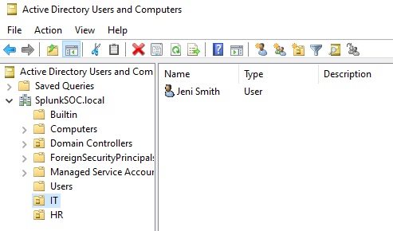
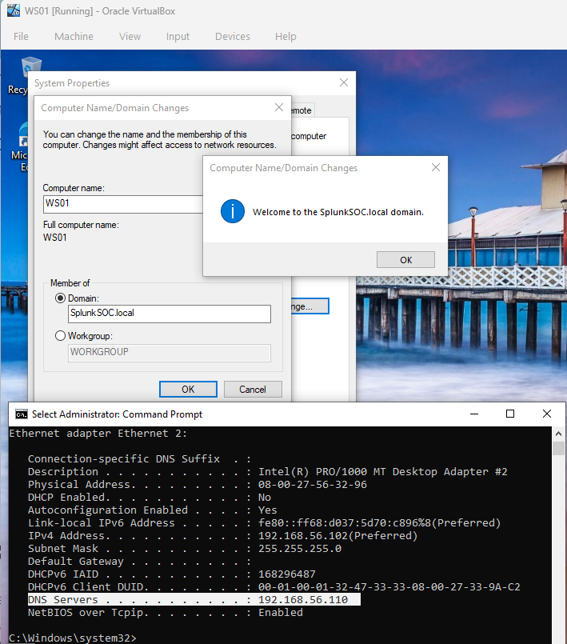
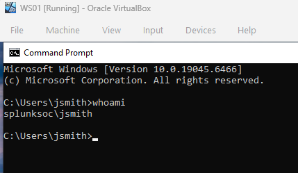
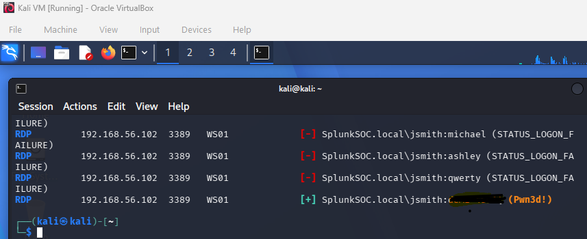
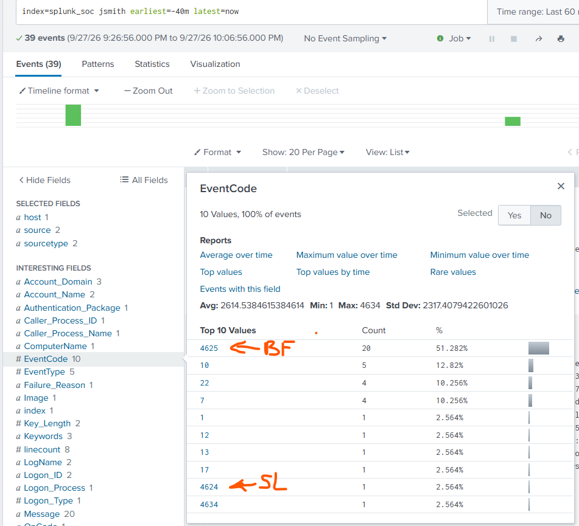
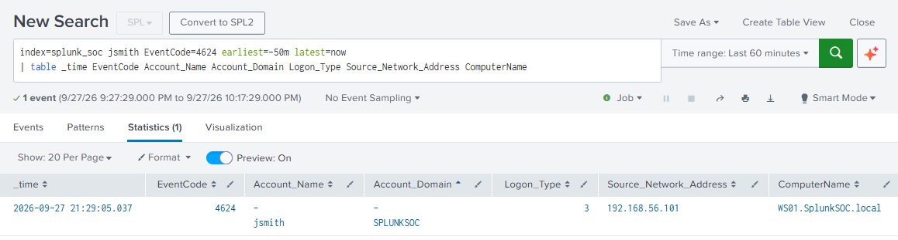

# SPLUNK SOC 1.0

## Objective
Build a centralized SOC monitoring workflow that ingests Windows security telemetry into Splunk, validates detection visibility through controlled attack activity and supports investigation of suspicious authentication events.

## Architecture & Environment
This project uses an isolated VirtualBox SOC lab comprising Active Directory, a Windows endpoint, Splunk Enterprise, and Kali Linux. All security testing was authorized and performed exclusively within the lab environment.

## Skills
**SIEM deployment & telemetry analysis** — deployed Splunk and analyzed centralized Windows Security and Sysmon events.  
**Network configuration & connectivity** — designed and validated the isolated VirtualBox Host-only SOC network.  
**Windows security & authentication analysis** — investigated EventCode `4624` and `4625` authentication activity.  
**Attack simulation & detection investigation** — executed controlled RDP authentication testing from Kali Linux and validated - resulting telemetry in Splunk.  
**Active Directory administration** — configured domain services, user accounts, OUs, domain membership and RDP access.

## Tools
**Splunk Enterprise** — centralized Windows security telemetry, detection, correlation and investigation.  
**Splunk Universal Forwarder** — forwarded WS01 endpoint telemetry to the centralized Splunk instance.  
**Sysmon** — provided detailed endpoint process and system activity telemetry.  
**Windows Server & Windows 10** — supported Active Directory, authentication, domain membership and RDP testing across DC1 and WS01.  
**Ubuntu Server** — hosted Splunk Enterprise and provided the SIEM ingestion infrastructure.  
**Kali Linux** — generated controlled authentication activity for detection validation.  
**Crowbar & NetExec** — simulated RDP authentication attacks and validated resulting detection telemetry.  
**VirtualBox** — provided the isolated SOC lab infrastructure for controlled security testing.

## Steps

### 1. Core Lab Configuration
Configured the VirtualBox Host-only network and validated connectivity across the SOC lab systems.

### 2. Splunk Deployment
Configured SPLUNK-SRV with static IP `192.168.56.130`, deployed Splunk Enterprise and enabled persistent service operation.

### 3. Telemetry Ingestion
Configured the Splunk Universal Forwarder on WS01 to collect Application, Security, System and Sysmon telemetry, created the `splunk_soc` index, enabled TCP `9997` ingestion and verified events from both Windows systems were successfully indexed in Splunk.

### 4. Active Directory Environment
Configured DC1 as the `SplunkSOC.local` domain controller, created the IT and HR OUs and domain accounts and joined WS01 to the domain.






### 5. Domain Authentication Validation
Validated domain authentication on WS01 with JSmith and confirmed the active domain context.



### 6. RDP Access Configuration
Enabled RDP on WS01 and configured authorized domain users for remote authentication testing.

### 7. RDP Brute-Force Simulation
Executed a controlled RDP authentication attack from Kali against WS01 with NetExec to generate realistic failed and successful Windows authentication telemetry for SOC detection validation.



### 8. SOC Investigation
Queried the `splunk_soc` index to correlate the generated authentication telemetry, confirming repeated `EventCode=4625` failures followed by `EventCode=4624` success (SL) and establishing the baseline authentication-detection capability of the SOC environment.



**Splunk table showing the successful JSmith logon, Logon Type 3, source IP 192.168.56.101, and target WS01.**



## Challenges & Troubleshooting
**Network addressing:** DC1 DHCP addressing caused inconsistent endpoint connectivity; static addressing was applied to stabilize the lab network.
**Sysmon ingestion format:** `inputs.conf` used XML rendering and the `XmlWinEventLog` sourcetype; corrected to `renderXml = false` with the standard `WinEventLog` Sysmon sourcetype.
**Forwarder destination:** WS01 Universal Forwarder retained the previous Splunk server address; `outputs.conf` was updated to `192.168.56.130:9997`.
**Validation:** Restarted the Universal Forwarder and confirmed fresh Sysmon events were indexed in the expected format.

## Summary

### Investigation Findings
Splunk established a working SIEM detection baseline by capturing and correlating repeated `EventCode=4625` failed logons followed by `EventCode=4624` success, providing visibility into brute-force authentication indicators and the originating source.

### Security Decision & Validation
The validated telemetry pipeline demonstrated that the SOC environment could collect, centralize, and investigate authentication activity across the Windows domain, providing a foundation for detecting brute-force attempts and potential lateral-movement activity.

## Operational Impact
Engineered a SIEM pipeline that collected Windows Security and Sysmon telemetry through the Universal Forwarder into Splunk, enabling raw endpoint events to be correlated into actionable authentication activity and source attribution.

---


# SPLUNK SOC 2.0 (SOC AUTOMATION WITH AI)


## Objective
Extend the existing Splunk SOC 1.0 environment into an automated SOC pipeline that detects unauthorized account activity, enriches security alerts with threat intelligence, uses AI-driven Tier 1 triage and delivers actionable findings to Slack.

## Architecture & Environment
This project extends the existing Splunk SOC 1.0 environment by integrating n8n, Google Gemini, AbuseIPDB and Slack to automate security-alert analysis, threat-intelligence enrichment and analyst notification.


## Skills
**SIEM monitoring & detection** — created Splunk authentication detections and routed triggered alerts into the automation pipeline.  
**SOC Tier 1 triage & threat intelligence** — enriched suspicious source IPs with AbuseIPDB and incorporated the results into alert analysis.  
**Security automation & AI-assisted analysis** — built an n8n workflow that passed Splunk alert data through Gemini for structured Tier 1 analysis.  
**Security integration & incident notification** — integrated Splunk, n8n, Gemini, AbuseIPDB and Slack into an automated alert-to-notification workflow.

## Tools

**Splunk Enterprise** — SIEM for detecting Windows authentication activity and generating security alerts.  
**n8n** — workflow automation platform connecting Splunk with analysis, enrichment, and notification services.  
**Google Gemini** — AI model used to structure and analyze security alerts.  
**AbuseIPDB** — threat-intelligence service used to enrich suspicious source IP addresses.  
**Slack** — notification platform used to deliver analyzed security alerts.  
**Docker & Docker Compose** — used to deploy n8n on the existing SPLUNK-SRV.  
**Windows Server, Windows 10 & Sysmon** — supplied endpoint security telemetry to Splunk.

## Steps

### 1. Deploy n8n on the Existing Splunk Server
Deployed n8n on the existing `SPLUNK-SRV` using Docker and Docker Compose to provide the automation layer for processing Splunk security alerts without introducing another VM.

**Docker Compose configuration:**

```text
    services:
      n8n:
        image: n8nio/n8n:latest
        restart: always
        ports:
          - "5678:5678"
        environment:
          - N8N_HOST=192.168.56.130
          - N8N_PORT=5678
          - N8N_PROTOCOL=http
          - N8N_SECURE_COOKIE=false
        volumes:
          - ./n8n_data:/home/node/.n8n
```

### 2. Create the Splunk Brute-Force Detection


Created a scheduled Splunk alert to detect failed Windows authentication activity and forward the resulting security alert into the automation workflow.

**SPL detection query:**

```spl
index=splunk_soc EventCode=4625 | stats count by _time ComputerName user src_ip
```

- Used Windows EventCode `4625` as the detection signal for failed authentication activity.
- Aggregated failed logons by timestamp, host, user, and source IP to expose concentrated authentication activity.
- Configured the `Test-Brute-Force` alert on a 1-minute schedule to evaluate recent authentication activity continuously.
- Routed triggered detections through the Splunk webhook action into the n8n automation pipeline.
- Validated the detection by generating controlled failed RDP authentication attempts against WS01.

### 3. Connect Splunk to n8n


Connected the Splunk alert to an n8n Webhook so security-alert data could be passed automatically into the analysis workflow.
The webhook received the alert's time, computer name, user, source IP and event count, confirming successful Splunk-to-n8n data transfer.

### 4. Integrate Gemini for SOC Alert Analysis
Integrated Google Gemini into n8n to structure security alerts into analyst-focused findings, including threat-intelligence enrichment, severity assessment, and recommended actions.

**n8n prompt template containing expressions:**

**Values 1**

```text
    Act as a tier one SOC analyst assistant when provided with a security alert. Perform the following steps:
    1. Summarize the alert.
    2. Enrich with threat intelligence.
    3. Assess the severity based on MITRE ATT&CK.
    4. Recommend next actions.

    Keep the response concise and focused. Avoid unnecessary explanations or lengthy detail.

    For any IP enrichment, use the tool named abuse-ipdb-enrichment.
```

**Values 2**

```text
    Format the output clearly. Return findings in a structured format such as Summary, IOC Enrichment, Severity Assessment, and Recommended Actions.
```

**Values 3**

```text
    Alert: {{ $json.body.search_name }}

    Alert Details: {{ JSON.stringify($json.body.result, ['_time', 'user', 'ComputerName'], 2) }}

    Source IP: 194.127.117.45
```

### 5. Connect n8n Workflow to Slack

Connected n8n to a dedicated Slack alerts channel to route completed SOC analysis directly to analysts for triage.

- Passed the structured Gemini analysis output into the Slack notification node.
- Formatted the alert payload into an analyst-readable notification containing the alert summary, IOC enrichment, severity assessment, and recommended actions.
- Routed the completed analysis to the designated SOC alerts channel.
- Validated end-to-end delivery from the n8n workflow to Slack.

### 6. Add AbuseIPDB Threat-Intelligence Enrichment

Integrated AbuseIPDB into the n8n workflow as an IOC-enrichment stage, allowing suspicious source IPs to be evaluated before Gemini performs the SOC analysis.

- Passed the detected source IP from the Splunk alert into the AbuseIPDB API enrichment node.
- Queried AbuseIPDB for reputation and abuse-history data associated with the source IP.
- Injected the enrichment results into the workflow alongside the original Splunk alert context.
- Fed the combined alert and threat-intelligence data to Gemini for contextual Tier 1 analysis.
- Validated that the workflow returned abuse confidence, report count, geographic information and threat context for the tested IP.

### 7. Validate the End-to-End SOC Workflow


Tested the complete **Splunk → n8n → Gemini → AbuseIPDB → Slack** workflow and verified that a detected brute-force alert was enriched, analyzed, assessed, and delivered to Slack.

## Challenges & Troubleshooting
The n8n Slack integration initially failed because the Docker container could not resolve Slack's hostname; container DNS and HTTPS tests identified the issue, and restarting the n8n container restored connectivity and successful Slack message delivery.

## Summary

**Investigation Findings:** Splunk correlated repeated Windows `EventCode=4625` failed-logon events into a brute-force detection trigger, providing the structured alert payload used by the downstream automation pipeline.

**Security Decision:** n8n, Gemini, AbuseIPDB and Slack were added to the existing Splunk SOC 1.0 environment to automate alert analysis while retaining Splunk as the detection and monitoring layer.

**Validation:** The completed workflow successfully enriched the source IP with AbuseIPDB and delivered a structured SOC analysis to Slack containing the alert summary, IOC enrichment, MITRE ATT&CK severity assessment, and recommended actions.

## Operational Impact
Automated the movement of a detected security alert from SIEM detection through threat-intelligence enrichment and Tier 1 analysis to analyst notification, reducing manual alert-handling steps.